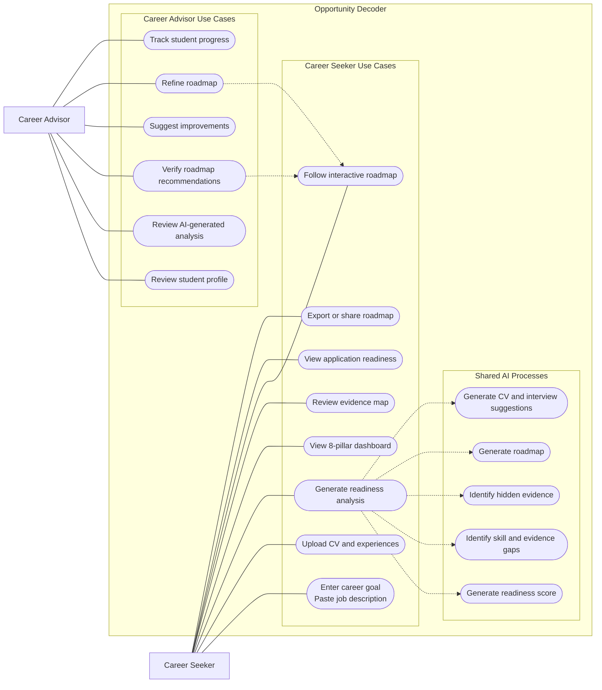

# Opportunity Decoder

Decode the role. Discover your evidence. Apply with confidence.

Opportunity Decoder is a hackathon MVP that helps students understand how close they are to being ready for a specific career opportunity. A student pastes a job description and their CV, skills, projects, volunteering, or other experiences. The app uses Azure OpenAI server-side to create an evidence map, readiness dashboard, and practical roadmap from "where I am now" to "ready to apply".

## Problem statement

Students often self-reject from internships, placements, insight schemes, scholarships, and graduate roles because they do not know how to translate their existing experience into employer language. This is especially true for students with no internship experience, first-generation students, students from underrepresented backgrounds, and students without strong professional networks.

## Solution

Opportunity Decoder analyses a target opportunity against a student's current evidence. It shows what they already have, what hidden evidence they are not communicating well, which gaps are blocking readiness, and which actions will move them fastest towards a credible application.

## What makes it innovative

This is not just a CV writer or job matcher. The core idea is opportunity access through evidence mapping and readiness roadmapping. The product helps students see that projects, societies, mentoring, coursework, volunteering, part-time work, and hackathons can all become career evidence when framed clearly and honestly.

## 8 Pillars of Engineering Career Development

1. Technical Foundations
2. Professional Experience
3. Portfolio & Proof of Work
4. Soft Skills
5. Industry Exposure & Events
6. Credentials & Continuous Learning
7. Strategic Positioning
8. Application Readiness & Interview Preparation

Each pillar receives a score, status, explanation, evidence found, blocking gap, and next action.

## Use Case Diagram

The diagram below gives a compact SysML-style overview of how the main users interact with Opportunity Decoder. It groups the core student journey, advisor actions, and shared AI processes so the system boundary stays readable and uses space more efficiently in GitHub Markdown.



## Azure OpenAI integration

The app calls Azure OpenAI only from the server-side API route at `POST /api/decode`. API keys are read from environment variables and are never exposed to frontend code.

If any Azure OpenAI environment variable is missing, the route returns realistic mock output so the demo still works offline or without credentials.

Endpoint format:

```text
{AZURE_OPENAI_ENDPOINT}/openai/deployments/{AZURE_OPENAI_DEPLOYMENT}/chat/completions?api-version={AZURE_OPENAI_API_VERSION}
```

## How to run locally

Run the merged frontend and API from the repository root. The separate `my-app` folder is an older Vite prototype and is not needed for the integrated MVP.

### Prerequisites

- Node.js 18.17+ (Next.js 14 minimum). Node 20 LTS recommended.
- npm 9+ (ships with Node).
- A terminal — examples below use **PowerShell on Windows**. Substitute `cp` for `Copy-Item` etc. on macOS / Linux.

### Install dependencies

From the repo root:

```powershell
npm install
```

### Start the development server

```powershell
npm run dev
```

You should see:

```text
▲ Next.js 14.2.x
- Local:    http://localhost:3000
✓ Ready in ...ms
```

Then open **http://localhost:3000**.

> **Only run one dev server at a time.** Multiple `npm run dev` processes fight for the `.next` build directory and the page will appear to "not load". If that happens, kill every `node` process running `next dev` / `next build`, delete the `.next` folder, and start a single server again. On Windows in PowerShell:
>
> ```powershell
> Get-CimInstance Win32_Process -Filter "Name = 'node.exe'" |
>   Where-Object { $_.CommandLine -match 'next|npm run dev' } |
>   ForEach-Object { Stop-Process -Id $_.ProcessId -Force }
> Remove-Item -Recurse -Force .next
> npm run dev
> ```

### Run checks

```powershell
npm run typecheck
npm run build
npm run lint
```

## Environment variables

Create `.env.local` from `.env.example`. On Windows:

```powershell
Copy-Item .env.example .env.local
```

On macOS / Linux:

```bash
cp .env.example .env.local
```

Set:

```text
AZURE_OPENAI_ENDPOINT=https://<your-resource-name>.openai.azure.com
AZURE_OPENAI_API_KEY=<your-key>
AZURE_OPENAI_DEPLOYMENT=<deployment-name-from-azure-portal>
AZURE_OPENAI_API_VERSION=2024-10-21
```

Notes:

- `AZURE_OPENAI_ENDPOINT` must include the protocol (`https://`) and **no trailing path** — just the resource root.
- `AZURE_OPENAI_DEPLOYMENT` is the **deployment name** you chose in the Azure portal (e.g. `gpt-4o-mini-decoder`), not the underlying model id like `gpt-4o-mini`.
- `AZURE_OPENAI_API_VERSION` must be a version your resource supports. Known-good values at time of writing: `2024-10-21`, `2024-08-01-preview`.
- Restart `npm run dev` after editing `.env.local` — Next.js only reads env files at boot.
- Do **not** commit `.env.local` or any API keys.

If any of the four variables is missing, the API route falls back to a built-in mock report so the UI is still demoable without credentials.

## Testing the decoder

### Quickest path

1. Open http://localhost:3000.
2. Click **Use demo example** to pre-fill the textareas.
3. Click **Decode Opportunity**.
4. Scroll to the **8-pillar dashboard**, the **evidence map**, and the **interactive roadmap** (curved road with hover-able milestone pins).
5. Tick a milestone or side-quest checkbox inside a roadmap pin's hover card to update the "X/Y completed" chip.

### Example custom inputs

Paste the following into the **Job description** textarea:

```text
Graduate Software Engineer — Lloyds Banking Group, Manchester (Hybrid)

We are hiring a Graduate Software Engineer to join our Digital Engineering function.
Essential: degree in Computer Science or related STEM (2:1+), strong programming in Java,
Python or TypeScript, Git, unit testing, code review, REST APIs, written/verbal
communication, and evidence of teamwork on a coding project.
Desirable: cloud (AWS/Azure/GCP), CI/CD, Docker, SQL, a public GitHub portfolio with a
deployed project, hackathon/open-source participation, agile awareness.
```

And into the **CV / background** textarea:

```text
Final-year BSc Computer Science student at the University of Manchester, predicted 2:1.
Built "TramTracker" — a TypeScript + React app on the TfGM live API, deployed to Vercel,
with Jest tests and GitHub Actions CI. Worked in a 4-person Java group coursework
(multiplayer chess) using Git branching, weekly stand-ups, and JUnit tests; owned the
move-validation module. Cleaned and analysed a UK rainfall dataset in Python/pandas.
Peer mentor for first-year Java (~6 students per session). Completed AWS Cloud
Practitioner Essentials on Coursera; no AWS deployment yet. Volunteered at
HackManchester 2024 registration. No internship yet.
```

The decoder should return varied pillar scores (Soft Skills and Technical Foundations strong, Professional Experience and Industry Exposure weaker) and a roadmap that names specific gaps like cloud deployment, CI/CD, and missing internship evidence.

## Troubleshooting

### "Result looks identical for every CV / score is always the same"

That means the API silently fell back to the built-in mock report. The UI will now show an **amber banner** at the top of the dashboard saying *"Showing the built-in demo report — the live Azure call did not run"* together with the reason.

Cross-check the **terminal running `npm run dev`** — the route prints one of:

| Log line | Meaning | Fix |
| --- | --- | --- |
| `[decode] calling Azure deployment=...` followed by `[decode] Azure success — overallReadinessScore=...` | Real call worked. | — |
| `[decode] Azure HTTP 401` | API key invalid or expired. | Regenerate `AZURE_OPENAI_API_KEY` in the Azure portal. |
| `[decode] Azure HTTP 404` | Wrong endpoint or deployment name. | Check `AZURE_OPENAI_ENDPOINT` and `AZURE_OPENAI_DEPLOYMENT`. |
| `[decode] Azure HTTP 429` | Rate / quota limit. | Wait, or raise the quota in the portal. |
| `[decode] route threw: AbortError ...` | Network couldn't reach Azure within 30s (firewall, VPN, offline). | Restore network access; the route times out at 30s. |
| `[decode] falling back to mock report — reason: missing env vars: ...` | One or more env vars unset. | Populate `.env.local` and restart `npm run dev`. |

### "The page won't load at all"

Almost always one of:

- Dev server isn't actually running — check the terminal still says `Ready` and the port hasn't been taken.
- Multiple `npm run dev` instances were started — see the "Only run one dev server" callout above.
- `.next` cache is corrupted from interrupted builds — delete it and restart.

### "Decoder returns score 0"

If the amber banner is **not** shown but every score is `0`, the model returned literal placeholder values. The prompt already instructs against this; if it recurs, restart `npm run dev` (so the latest [app/api/decode/route.ts](app/api/decode/route.ts) is loaded) and decode again.

## Demo flow

1. Open the app.
2. Click **Use demo example**.
3. Click **Decode Opportunity**.
4. Show the opportunity summary and overall readiness score.
5. Walk through the 8-pillar dashboard.
6. Open the evidence map and highlight hidden evidence.
7. Tick roadmap items to show the interactive readiness plan.
8. Copy a CV bullet or motivation answer from the application booster.
9. End on the "Should I apply?" recommendation.

## Future improvements

- PDF CV parsing
- LinkedIn import
- University careers service dashboard
- Mentor review mode
- Employer-facing inclusive recruitment insights
- Application tracker
- Personalised learning resources
- Progress saving across multiple opportunities
